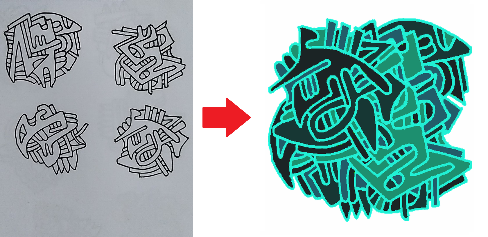
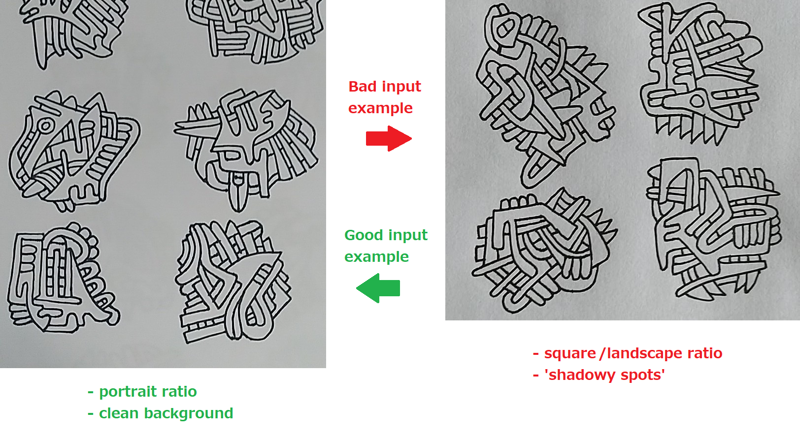

# python-auto-painter

Auto painter and timelapse maker for the drawings in my IG page [@aqueleangelo](https://www.instagram.com/aqueleangelo/)

It gets a linework (if there's any) from a folder in my google drive, paints it, makes a collage, video time lapse of the process and then places it in another drive folder.
With some modification, could be used to paint other styles.

Results posted daily at [@aqueleangelo](https://www.instagram.com/aqueleangelo/)

## Getting Started

These instructions will get you a copy of the project up and running on your local machine for development and testing purposes. See deployment for notes on how to deploy the project on a live system.

### Prerequisites

This was built in python 3.8, with the lasted versions of all modules as today *(2020/7/6)*. 

It uses two different APIS tho get color pallets and names. See 'Built with' section.

#### Modules
You will need a bunch of different modules, check the 'autopainter.py' and 'gdriveservice.py' for the names.
#### How and what images to feed the program

* The image input need to be located at a drive folder in root called 'bloob_buffer' (you could change this).
* The image input need to be in the '.jpg' (you could change this).
* The image input feed need to be in 'portrait mode' (that is the height of the image > width) (you "can't" change this).
The program will run fine with landscape images, but it will rotate it to portrait. It's a fix, don't question it.
* The cleaner the input, the better the result (and least likeliness that it breaking horribly) (see the image above)
* The optimal number of whole 'pictures' inside the image is 4, for my intended result (but it will glob as many pictures you give it).
* The results will be uploaded back to drive in a folder called 'Bloobs' (you could change this).
#### Timelapse audio
* The audio clips need to be '.mp3' and called 'tune_' + random.choice(blob.blob(audioFolderPath + '*.mp3') + '.mp3'. I can't decribe it a better way (also you could change this).
* Check the folder, there are examples.
* The audio length needs to meet the timelapse lenghts in your case. In mine, to color 3 ~ 5 pictures, 10 second clips are long enought.
* If its to short, it will mute mid video, if its too long, it will drag the last frame.
### If you use VSCode...
* You might need to edit the 'settings.json' w/ your python path & the 'myDriver' folder location.

### Installing

1. Download or clone the repository
2. Go to 'autopainter.py' and update all the 'path' variables (except the 'videoPath' one)
3. Create 3 new additional folders named 'Images', 'Lines' and 'Frames' at the root folder.
4. Create 2 folders at your google drive root named 'bloob_buffer' and 'Bloobs'
5 If you haven't yet, do the [python quickstart](https://developers.google.com/drive/api/v3/quickstart/python) at the google drive API
6. Add your 'credentials.json' and 'token.pickle' (created at the step above) to the 'myDrive' folder to give the application access to your drive
7. Add a new linework image to the 'bloob_buffer' folder and run the application (reffer to the good/bad image example)
8. In a few seconds, you should see a finished linework & timelapse uploaded at your 'Bloob' drive.

## Deployment

I implemented this in a [pythonanywhere](https://www.pythonanywhere.com/) live server to get advantage from the task schedule, 
so I don't have to mannualy start the process for new lines daily. Thats easily achievable, just copy all the code, folders and follow the installing accordingly. Change paths as needed.

*OBS.: If you have any problem related to sockets there, reinstalling the pysockets module solved it here. Also Google is your friend.*

## Built With

* Python with a bunch of modules. Most notably the 'requests', 'PIL', 'cv2', 'moviepy' and the google drive ones.

## Authors

* **Angelo Leite** - *Initial work* - [angelolmg](https://github.com/angelolmg)

## License

This project is licensed under the MIT License - see the [LICENSE.md](LICENSE.md) file for details

## Acknowledgments

* People from [colormind.com](http://colormind.io/)
* People from [herokuapp.com](https://random-word-api.herokuapp.com/home)
* People from [pythonanywhere.com](https://www.pythonanywhere.com/)
